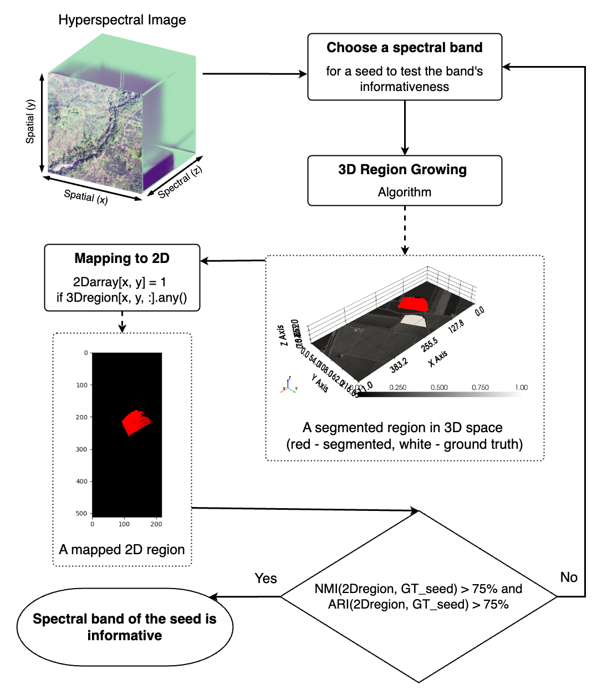
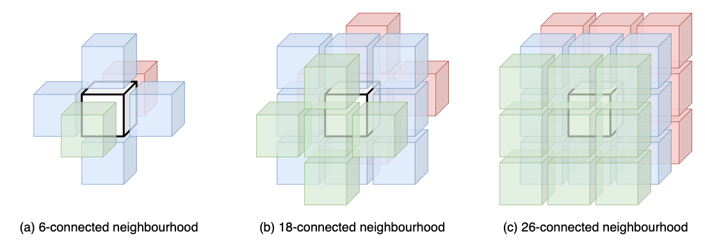
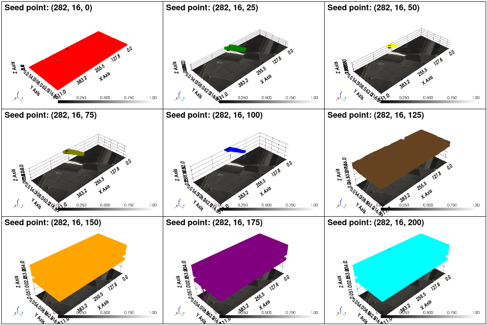

# 3D Region-Growing Spectral Band Prioritization for HSI

This repository contains the code for the proposed approach in:

**A region-growing approach for spectral band prioritization in hyperspectral remote sensing**

The method selects informative spectral bands in HSI by growing a 3D region from a
seed point in spatial-spectral space, projecting the grown region back to a 2D mask,
and scoring the projection against a region of interest when labels are available. The figure below presents a high-level overview of the proposed method:

<p align="center" width="100%">

</p>

For labelled datasets, the paper selects seed spatial coordinates from the region of interest using the ground truth, scans candidate seed bands, and compares each projected 3D RGA region to the seed class mask using NMI and ARI. For unlabelled data, the method scans seed bands from selected spatial points, then supports interactive expert-driven band selection by comparing grown-region size, spatial coherence, and TuiView-based visual inspection of the 3D segmentation outputs.

Cython is used in implementation because 3D region growing repeatedly visits neighbouring voxels
inside large hyperspectral cubes. Moving that inner loop into compiled code avoids
most Python per-voxel overhead while keeping the rest of the workflow in readable
NumPy/Python. The Cython region-growing routine in `RegionGrowth.pyx` is motivated by Pengyi
Zhang's RegionGrowth project: https://github.com/PengyiZhang/RegionGrowth.

## Features

- 3D Region Growing Algorithm (3D RGA) on hyperspectral cubes.
- HSI cube convention: `(height, width, bands)`.
- Seed convention: `(row, column, band)`.
- 6-connected 3D neighbourhood.
- Seed-intensity stopping criterion:

```text
seed_value - 0.1 * mean(cube) < neighbour_value < seed_value + 0.1 * mean(cube)
```

- Projection of the grown 3D region to a 2D spatial mask by union across bands.
- Export of grown 3D regions to TuiView-readable GeoTIFF stacks for visual inspection.
- Band scoring with Normalized Mutual Information (NMI) and Adjusted Rand Index (ARI).
- Informative-band selection with a 0.75 NMI/ARI threshold, relaxed to `0.75 * max_score` when a class never reaches 0.75.
- Final segmentation aggregation over ten equidistant bands in the selected range:
  - ARC: all-regions consensus.
  - MRR: majority-regions rule.

The implementation uses the 6-connected neighbourhood shown below. The 18- and
26-connected neighbourhoods are included for context, matching the discussion in the
publication.

<p align="center" width="100%">

</p>

The region-growing loop evaluates unchecked neighbours against the seed-intensity
threshold and returns a binary 3D segmented region as depicted in the figure below:

<p align="center" width="100%">

</p>

## Algorithm and TuiView Workflow

The code supports two complementary ways to use the proposed algorithm:

1. `run_band_search.py` runs 3D RGA over candidate seed bands, projects each 3D
   region to a 2D mask, and scores each band with NMI/ARI when labels are
   available.
2. `visualize_tuiview.py` runs the same 3D RGA step but exports the binary 3D
   segmentation volumes as GeoTIFF raster stacks for inspection in
   [TuiView](https://tuiview.org/).

This mirrors the publication workflow: the algorithm identifies bands
quantitatively, while TuiView is used to inspect how the grown 3D regions change
across spectral seed bands, as in the Salinas example below:

<p align="center" width="100%">

</p>

Each `*_region3d.tif` written by `visualize_tuiview.py` stores one binary 3D RGA
output as a raster stack where GeoTIFF bands correspond to HSI spectral bands. Each
`*_projection2d.tif` stores the 2D union projection used for NMI/ARI scoring.

## Files

- `src/hsi_region_growing.py`: main implementation.
- `src/dataset_presets.py`: dataset-specific preprocessing for the paper datasets.
- `run_band_search.py`: command-line runner for `.mat` HSI datasets.
- `visualize_tuiview.py`: exports 3D RGA segmentation volumes as GeoTIFFs for TuiView.
- `assets/`: figures from the publication and qualitative Salinas examples.
- `RegionGrowth.pyx`: fast Cython HSI 3D grower.
- `setup.py`: builds the Cython extension in place.

## Install

```bash
python -m pip install numpy scipy cython
python setup.py build_ext --inplace
```

The expensive 3D region-growing loop runs through Cython when the `RegionGrowth` extension is built. If the extension is missing, the Python API falls back to the pure Python implementation so tests and small examples still run.

To inspect exported 3D regions, install TuiView:

```bash
conda create -n tuiview-env -c conda-forge tuiview
conda activate tuiview-env
```

For installation problems or platform-specific dependencies, see the
[TuiView website](https://tuiview.org/).

## Data

Benchmark datasets such as Salinas, Indian Pines, and Pavia Centre can be
downloaded from the Hyperspectral Remote Sensing Scenes page:
https://www.ehu.eus/ccwintco/index.php/Hyperspectral_Remote_Sensing_Scenes

Place the downloaded `.mat` files under `datasets/` before running the examples.

## Usage

Run band prioritization for class 1 using the Salinas preset. The preset supplies
the default `.mat` keys `salinas_corrected` and `salinas_gt`, so they do not need to
be passed explicitly.

```bash
python run_band_search.py \
  --dataset salinas \
  --cube datasets/Salinas_corrected.mat \
  --labels datasets/Salinas_gt.mat \
  --class-id 1 \
  --seed-row 80 --seed-col 60 \
  --out outputs/salinas_class_1_scores.csv
```

The script prints the selected band indices, contiguous selected ranges, and ARC/MRR
scores for the widest selected range. It also writes per-band NMI/ARI scores to CSV.

Export 3D region-growing outputs for TuiView using the same style of seed-band
sequence shown in the Salinas visualization figure:

```bash
python visualize_tuiview.py \
  --dataset salinas \
  --cube datasets/Salinas_corrected.mat \
  --seed-row 282 --seed-col 16 \
  --seed-bands 0 25 50 75 100 125 150 175 200 \
  --out-dir outputs/tuiview_salinas
```

Add `--open-tuiview` to launch TuiView after the GeoTIFF files are written.

Band-score CSV files are written to the path passed with `--out`, and TuiView
GeoTIFF files are written under the directory passed with `--out-dir`. Output
folders are created automatically when needed.

By default, the runner normalizes the cube to `uint8` and uses the Cython grower. If you pass `--no-normalize` with a non-`uint8` cube, the runner uses the slower Python grower unless you convert the cube beforehand.

Use `--dataset` for the paper datasets:

- `salinas`: accepts raw 224-band AVIRIS cubes or already-corrected 204-band cubes. Raw cubes have the reported water-absorption bands removed.
- `indian_pines`: accepts raw 224-band AVIRIS cubes or corrected 204-band cubes. Raw cubes have the reported water-absorption bands removed.
- `pavia_centre`: accepts the 102-band ROSIS cube without spectral removal.
- `nerc_arf`: accepts the raw 622-band AisaFENIX cube or the 207-band processed cube. Raw cubes are downsampled by averaging non-overlapping triples and dropping the final leftover band.

For NERC-ARF or other unlabeled data, omit `--labels`. As in the paper, the
unlabelled workflow relies on per-band 3D region growth and visual/size-based
inspection rather than ground-truth scores. The runner writes per-band grown-region
sizes instead of NMI/ARI:

```bash
python run_band_search.py \
  --dataset nerc_arf \
  --cube nerc_arf.mat --cube-key cube \
  --seed-row 120 --seed-col 240 \
  --band-start 0 --band-stop 206 \
  --out outputs/nerc_seed_stats.csv
```

## Qualitative Example

The Salinas benchmark illustrates how selected spectral bands can preserve
class-specific regions while also exposing areas where spectral ambiguity or noise
affects segmentation.

<p align="center" width="100%">

</p>

The same spatial seed can produce very different 3D regions depending on the seed
band. This is the signal used by the band-prioritization routine: bands that project
to coherent target masks score higher, while bands that over-grow or fragment the
region score lower.

## Advanced Python API

The command-line scripts wrap the main functions in `src/hsi_region_growing.py`.
Import these helpers directly for notebooks or custom pipelines:

- `normalize_to_uint8(cube)`
- `region_grow_3d(cube, seed)`
- `project_region_to_2d(region)`
- `find_informative_bands(cube, spatial_seed, target_mask)`
- `aggregate_selected_bands(cube, spatial_seed, selected_bands)`

## Citation

If you use this code, please cite the manuscript:

```bibtex
@misc{zhambulova2026region,
  title = {A region-growing approach for spectral band prioritization in hyperspectral remote sensing},
  author = {Zhambulova, Gulnaz and Lukac, Martin and Mokros, Martin and Nagayama, Shinobu and Moln{\'a}r, Ferdinand},
  year = {2026},
  note = {Manuscript under review}
}
```
